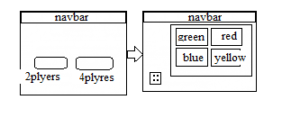

# Ludo-King Game

## Instructions
Two or four can play, without partnerships. At the beginning of the game, each player's four tokens are out of play and staged in the player's yard (one of the large corner areas of the board in the player's colour). When able to, the players will enter their tokens one per turn on their respective starting squares, and proceed to race them clockwise around the board along the game track . When reaching the square below his home column, a player continues by moving tokens up the column to the finishing square. The first to bring all their tokens to the finish wins the game. The others often continue to play to determine second, third, and fourth-place finishers.

### technologies used :
* html & css.
* JavaScript .
* jQuery and vanilla javascript for DOM manipulation.
### Wireframe


### Planning
First create html, css and javaScript files. Then design the html ludo-king pages. After that I work on background posts. Finally, get the user experience.

### User Stories
* As a player I want to add my name so that I can Know it is my turn. 
* As a player I want to able continue  play so that we can determine second and third winner.
* As a player I want to add 2 and 4 players so that I can play with my friends.
* As a player I want to able kill pawn players so that it makes playing more exciting.
* As a player I want to add 3 players so that we can play if we are 3 only.

### Problem-solving strategy
1. Google it.
2. Console.log or alert.

### solved for the winner
The player who delivers all the pawns to the endpoint wins.

```javascript
// check for winner and display the winner 
var pawnOut = {red:0,blue:0,green:0,yellow:0}
function CheckForWinner() {
    if (pawnOut[currcolor] == 4) {
        var dice = document.getElementById("dice");
        var player = document.getElementById("player");
        dice.innerText = "";
        dice.style.visibility = "hidden";
        player.innerText = "The Winner is the "+ currcolor + " player";
    }
}
```

### favorite functions work
My favorite job is the random number that describes that it must change from one player to another every time a player does not get a dice equal to six and change the number of dice.

```javascript
//randomNumber on click dice 
const randomNumber = function () {
    if (!clicked) {

        var audio = document.getElementById('audio');
        audio.play();

        num = Math.floor((Math.random() * 6) + 1);
        $('#dice').css('background-image', 'url(Images/' + num + '.png)');
        clicked = true;
    }
    if (num != 6 && notFree()) {
        var bad = document.getElementById('bad');
        bad.innerText = "Unfortunatlly you stuck";
        setTimeout(changePlayer, 1000);
        clicked = false;
    }
}
$('#dice').on('click', randomNumber);
```

### Resource
[SIMPLE LUDO GAME IN JAVASCRIPT WITH SOURCE CODE](https://code-projects.org/simple-ludo-game-in-javascript-with-source-code/)
